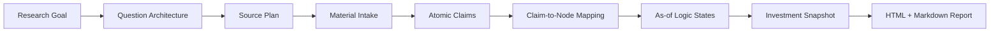

# Value Invest Research

一个以文件系统为事实源、以第一性原理逻辑链为中心的专业投资研究系统。

它把研究目标、问题架构、原始材料、原子观点、逻辑节点、历史截面和投资判断保存为可审计工件，避免把“搜索到材料”“生成了报告”和“投资结论已经成立”混为一谈。

> 本项目不是自动交易系统，不下单，也不把模型输出当作最终买卖建议。所有结论都需要可追溯证据、反证检查和人工复核。

## 核心投资逻辑

系统围绕一条固定的投资链工作：

1. 证明一条足够大、持久且接近拐点的 S 曲线真实存在。
2. 找到会被该趋势放大的 BOM / 价值链节点。
3. 判断节点是否稀缺、难替代，并由谁控制供给。
4. 验证公司能否把节点优势转成收入、毛利、自由现金流或估值重估。
5. 判断市场是否已经充分定价，并定义可监控的反证和下行边界。

主题热度、TAM 标题、方便交易的股票代码和事后股价表现都不能单独构成投资证据。

## 研究工作流



关键边界：

- 搜索结果只是候选材料，不是证据。
- 一份报告可以服务多个问题，但每个问题都需要独立解析。
- 原始材料先拆成不可变的原子观点，再通过独立映射影响逻辑节点。
- 预测、代理指标和背景信息不能因为方向一致就升级为直接支持。
- 当前结论来自必要条件与关键因果桥，不是“支持材料数量减反对材料数量”。
- 历史研究使用严格的 `as_of_date`；截面之后的信息只能隔离或作为事后标签。

## 当前支持的研究模式

### 1. 行业 / S 曲线 / 产业链研究

行业项目先建立统一 BOM taxonomy，再为每个 canonical BOM 节点创建独立子项目。每个节点研究六个问题：

1. 当前 BOM 的需求是否会被 S 曲线放大拉动？
2. 供给能否跟上？
3. 谁控制供给？
4. 是否已经财务兑现？
5. 市场是否已定价？
6. 反证是什么？

父项目负责产业链索引和聚合标的；`boms/<node_id>/` 子项目拥有自己的来源、时间账本、六问结论和报告。

### 2. 独立 BOM 五视角研究

当研究对象明确收窄到一个 BOM 节点时，使用 `report_scope: standalone-bom`。公开报告固定为：

1. `当前投资判断`
2. `需求侧`
3. `供给侧`
4. `技术侧`
5. `估值侧`
6. `ESG`

每个视角以第一性原理因果链组织。每个逻辑节点先给当前状态和节点结论，再展示按发布日期倒序排列的原子观点材料：

`发布日期 | 报告名称 | 材料类型 | 原子观点 | 对逻辑点的影响`

映射影响包括 `support`、`refute`、`boundary`、`constraint`、`new_branch`、`conflict`、`unresolved`、`neutral` 和 `unmapped`。其中 `support` / `refute` 只用于直接适配且明确满足节点规则的证据。

当前可阅读示例：

- [GPU / ASIC BOM 项目说明](research/bom/gpu_asic_bom_live/README.md)
- [GPU / ASIC BOM Markdown 审计报告](research/bom/gpu_asic_bom_live/professional_report.md)

### 3. 公司基础研究

公司研究采用 foundation-first 顺序。先回答“这家公司是什么”，再用 FengHe 处理消息流、催化剂、边际变化和 thesis revision。

八个公司基础模块是：起源、历史、当前业务、价值链位置、竞争格局、战略、组织文化与治理、风险扫描。

### 4. 通用问题研究

Meta-QA 工作流可以从一个公司、行业、事件或自定义问题生成最多五层的内部问题架构，随后执行来源规划、材料搜集、叶子问题解析、答案综合和报告输出。

## 证据与时间模型

每条原子观点尽可能保留四个时间字段：

- `published_at`：市场何时可以知道这条信息。
- `effective_period`：事实描述的实际期间。
- `target_period`：预测指向的未来期间。
- `ingested_at`：系统何时收到材料。

来源同时保留两个正交分类：

- `material_class`：官方财报、公司材料、卖方研报、权威第三方、市场消息、专家观点等。
- `ingestion_channel`：问题搜索、知识库扫描或手工导入。

IMA 等知识库的目录日期、上传时间和真实发布日期不是同一个字段。未经原文封面或明确字段验证的 `published_at`，不能进入公开时间线或历史回测证据账本。

## 项目工件

一个独立 BOM 项目的核心目录如下：

```text
research/bom/<project_id>/
  project.json
  timeline_profile.json
  sources.jsonl
  professional_report.html
  professional_report.md
  source/
    ima/
    manual/
  material_intake/
    documents.jsonl
    directory_candidates.jsonl
    scan_events.jsonl
  inbox/
    materials.jsonl
    parse_tasks.jsonl
  ledger/
    claims.jsonl
    claim_mappings.jsonl
    logic_states.jsonl
    entity_states.jsonl
    thesis_revisions.jsonl
    investment_snapshots.jsonl
```

`claims.jsonl` 保存不可变观点；映射、状态和投资判断使用独立的追加式账本。修改逻辑链或纠正映射时不会重写原始观点历史。

## 安装

要求 Python 3.11 或更高版本。

```bash
python3 -m venv .venv
source .venv/bin/activate
python3 -m pip install -e ".[dev]"
```

可选集成：

```bash
python3 -m pip install -e ".[ingest]"   # market data
python3 -m pip install -e ".[llm]"      # OpenAI-compatible LLM
python3 -m pip install -e ".[research]" # YAML research config
python3 -m pip install -e ".[all]"
```

安装后：

```bash
value-invest-research --help
```

不安装也可以直接运行：

```bash
PYTHONPATH=src python3 -m value_invest_research --help
```

## 常用命令

### 独立 BOM 报告

```bash
PROJECT=research/bom/gpu_asic_bom_live

PYTHONPATH=src python3 -m value_invest_research \
  refresh-standalone-bom-report "$PROJECT" --as-of-date 2026-08-13

PYTHONPATH=src python3 -m value_invest_research \
  validate-standalone-bom-engine "$PROJECT" --as-of-date 2026-08-13

PYTHONPATH=src python3 -m value_invest_research \
  validate-material-intake "$PROJECT"

PYTHONPATH=src python3 -m value_invest_research \
  validate-report-contract "$PROJECT/professional_report.html" \
  --mode live_prediction --require-l3
```

### 公司研究

```bash
value-invest-research init-stock MSFT --company-name "Microsoft Corporation"
value-invest-research build-evidence MSFT
value-invest-research run-stock-qa-pipeline MSFT \
  --run-local-collection --synthesize-answers --write-professional-report
value-invest-research validate-qa-system MSFT --require-professional-report
```

### 通用 Meta-QA

```bash
value-invest-research build-meta-qa \
  --object-type industry \
  --object-id "AI glasses" \
  --meta-question "Does the industry have durable investment value?" \
  --project-id ai_glasses
```

## 质量门槛

研究完成不是“文件存在”，而是语义门槛已经通过。系统会检查：

- 来源计划、主动搜索和外部材料入口是否留痕。
- 事实、预测、代理、观点和反证是否被区分。
- 原子观点是否拥有来源、定位和可见时间。
- `support` / `refute` 是否直接适配节点规则。
- 关键问题是否具有来源多样性、时效性、冲突和缺口记录。
- 公司财务桥、估值、反证和风险控制是否足以支持投资动作。

`actionable_long` 只有在逻辑覆盖、公司财务桥、估值、反证和风险控制全部通过时才允许出现；否则状态保持 `watch_only` 或 `no_action`。

## 测试与验证

```bash
python3 tools/run_tests.py
```

或者：

```bash
PYTHONPATH=src python3 -m unittest discover -s tests
```

框架或报告变更完成前，至少运行相关单元测试、报告契约校验、材料入口校验、研究工件校验和 `git diff --check`。

## 代码架构

项目遵守六边形依赖方向：

```text
adapters/inbound  -> application -> domain
adapters/outbound -> ports       -> application
application       -> ports + domain
domain            -> pure research rules
```

- `src/value_invest_research/domain/`：纯研究规则、实体、状态、评分和质量门槛。
- `src/value_invest_research/application/`：研究用例和编排。
- `src/value_invest_research/ports/`：仓库、搜索、解析和渲染协议。
- `src/value_invest_research/adapters/`：文件系统、搜索、LLM、市场数据、CLI 和报告渲染。
- `skills/value_invest_research/`：规范化研究流程、领域框架和公共呈现契约。
- `config/`：来源 universe、材料 feed、研究对象和 provider 配置。

进一步阅读：

- [六边形研究系统架构](docs/architecture/hexagonal_research_system.md)
- [公共研究报告契约](skills/value_invest_research/frameworks/research_report_contract.md)
- [项目级执行约束](AGENTS.md)

## 数据与安全边界

- 仓库级 `source/ima/` 是私有原文镜像，默认不进入 Git。
- IMA 归档只使用用户可见、已登录的页面逐项点击下载，不读取 Cookie、令牌或隐藏下载地址。
- 受限 PDF 不会在没有明确授权时发送给外部模型。
- 密钥、凭据、原始知识库 ID 和浏览器会话信息不得持久化。
- HTML 是默认阅读产物，Markdown 是可移植审计侧车；两者来自同一研究状态。

## 边界声明

研究输出必须区分事实、推断和判断。低可靠性材料可以创建研究问题，但不能单独提高结论强度。任何标的结论都必须明确对应的 BOM / thesis 节点、盈利传导、市场定价、主要反证和可执行降级条件。
