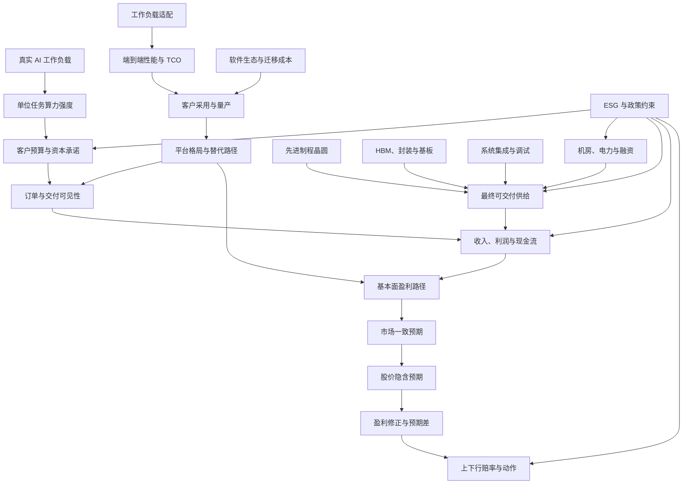

# GPU / ASIC BOM 研究计划书

> 项目：`gpu_asic_bom_live`  
> 研究范围：独立 BOM（`standalone-bom`）  
> 研究模式：实时跟踪（`live_prediction`）  
> 基线截面：2026-08-28  
> 计划编制日期：2026-09-02  
> 逻辑链版本：`2026-08-12.v2`  
> 文档性质：人类可读研究计划；对应 `qa_tree.json`、根 `research_plan.json`、27 份 `l3_research_plans/<l3_node_id>/research_plan.json` 与各自追加式事件账本

---

## 1. 研究任务

### 1.1 研究对象

本项目研究数据中心 GPU、云厂自研 ASIC 及其形成可运行 AI 算力系统所必需的关键供给条件。研究对象不是单颗芯片，也不是泛 AI 主题，而是以下商业闭环：

`真实工作负载 -> 单位任务算力 -> 客户预算 -> 订单 -> 可交付系统 -> 收入/利润/现金流 -> 市场预期 -> 投资赔率`

研究同时覆盖五类会改变闭环结果的约束：技术路线、先进晶圆、HBM/封装、系统集成与机房条件，以及出口、集中度、治理和融资风险。

### 1.2 最终投资决策问题

在当前研究截面，GPU / ASIC 是否处于真实、持久且仍有剩余空间的 S 曲线；产业价值由哪些平台和公司捕获；这些公司的盈利弹性是否尚未被市场充分定价，并且下行风险是否可以通过明确指标及时监控？

最终输出只允许三种状态：

- `actionable_long`：需求、技术、供给、盈利、估值、反证和风险控制全部通过。
- `watch_only`：产业或公司逻辑部分成立，但仍有关键证据、估值或风险门禁未通过。
- `no_action`：缺少直接 BOM 映射，或核心逻辑被反证。

本计划不预设买卖结论。研究问题全部完成以前，不能由主题热度、TAM、目标价或股价表现替代投资判断。

### 1.3 核心待验证假设

1. **H1：真实需求。** 训练、推理和 agent 工作负载增长快于软硬件效率改善，使总算力需求继续扩张。
2. **H2：价值捕获。** GPU 与 ASIC 的份额由工作负载适配、端到端 TCO、软件生态和客户量产共同决定，而不是由单项峰值性能决定。
3. **H3：有效供给。** 可交付系统受晶圆、HBM/封装、机架集成、网络、电力和融资的最短板约束，供给释放可能慢于订单增长。
4. **H4：盈利兑现。** 需求与供给关系能够转化为相关公司的收入、毛利、自由现金流和每股收益，而不是停留在采购承诺或低质量收入。
5. **H5：仍有赔率。** 基本面上修速度高于市场已经计入的增长、份额和利润率路径，并且主要下行可以量化监控。

### 1.4 研究边界

#### 纳入范围

- 数据中心 GPU、训练/推理 ASIC、相关软件平台和机架级系统。
- 需求验证实体：Microsoft、Amazon/AWS、Alphabet/Google、Meta、Oracle、AI 模型公司、GPU 云和主权算力主体。
- 直接价值捕获候选：NVIDIA、AMD、Broadcom、Marvell、Alphabet、Amazon，以及有可验证 ASIC 设计或平台收入的相关公司。
- 关键供给验证实体：TSMC、Samsung、SK hynix、Micron、先进封装/基板/ODM 和数据中心基础设施提供方。
- 会改变可服务市场、交付量、资本成本或股东回报的 ESG 与政策约束。

#### 排除或限制

- 消费显卡和游戏 GPU，除非其影响共同产能、产品组合或公司财务桥。
- 只有主题相关性、没有 GPU/ASIC 收入或成本桥的公司。
- 无法验证发布日期的材料不得进入时间线或支持当前结论。
- 市场消息和个人观点只能形成线索，不能单独增强节点结论。

---

## 2. 嵌套问题架构

### 2.1 层级定义

- **L1：最终决策问题**——GPU / ASIC BOM 是否存在可行动的投资机会？
- **L2：研究镜头**——需求、供给、技术、估值、ESG。
- **L3：投资判断问题**——27 个稳定逻辑节点；根步骤只负责汇总，不直接搜集材料或判定完成。
- **L4：独立研究维度**——每个 L3 分别展开边界与口径、当前事实、历史变化、前瞻路径、因果与财务传导、交叉验证、反证与失效条件。
- **L5：最细可执行叶子**——每个 L4 至少一个叶子问题；搜索、解析、GPT 复核、回答和证据门禁全部绑定在 L5。

每个 L3 单独拥有一个版本化研究计划。根 `research_plan.json` 中的 L3
步骤是 `child_plan_rollup`；只有相应子计划的全部必需 L5 叶子通过，L3 才能
完成。当前共 27 个 L3 子计划、189 个 L5 叶子。

### 2.2 叶子级材料搜集硬约束

- 每次材料搜索必须从一个 L5 叶子发起，并携带 `l3_plan_id`、
  `l3_node_id`、`l4_question_id`、`leaf_question_id`、`leaf_step_id` 和
  `search_run_id`。
- IMA 日归档、知识库扫描和人工导入可以保存宽泛候选材料，但候选材料本身
  不得通过后续批量映射直接成为任何叶子的完成证据。
- 同一来源若服务多个叶子，必须针对每个叶子分别建立附件、来源提取和 GPT
  复核；不得“一次解析，多处复用”。
- 旧有宽泛搜索和既有映射继续保留用于审计，但不追认本版 L5 完成状态。

### 2.3 总体因果关系



---

## 3. L2-A：需求侧研究计划

### 3.1 第一性原理逻辑链

需求侧必须证明：真实任务增加，并且单位任务所需算力没有被效率改善完全抵消；客户有能力把需求转成预算和订单；订单最终进入收入、毛利和现金流。需求方列表和数量矩阵只是派生视图，不能替代因果链。

### 3.2 L3-A1：需求方分类

**研究问题：** 当前有哪些数据中心 GPU 需求方，哪些主体只是潜在未来需求方？  
**步骤 ID：** `step:demand.demand_universe`  
**决策用途：** 固定后续数量、预算和订单研究的互斥分类，防止把 OEM、渠道和终端需求重复计算。  
**数据与材料：** 当前采购、部署、算力消费或生产使用证明；潜在主体的进入条件。优先客户财报、IR、采购/部署公告和监管材料。  
**反证：** 搜索主体是否只是渠道、代采或合作伙伴；检查同一主体是否同时进入当前与潜在两组。  
**依赖：** 无。  
**产物与门禁：** 输出“当前需求方”和“潜在未来需求方”两份互斥清单；每个当前需求方至少有一个可追溯的采购、部署或消费证据，否则标记为潜在或缺口。

### 3.3 L3-A2：当前需求量基线

**研究问题：** 按需求方逐类看，当前可验证的系统数、芯片数、算力、支出或价值代理是多少？  
**步骤 ID：** `step:demand.current_quantity`  
**决策用途：** 建立可复现的当前数量基线，避免用行业总量替代客户级需求。  
**数据与材料：** 客户采购/部署数量、云算力容量、GPU/ASIC 数量、AI capex、服务器出货和无法分配的行业总量。  
**反证：** 检查单位、期间、样本、主体是否重叠；不得机械分配行业总量或跨口径求和。  
**依赖：** `demand.demand_universe`。  
**产物与门禁：** 对每个当前需求方形成直接值、代理值、样本值或明确缺口；潜在需求和无法映射的总量单独列示。

### 3.4 L3-A3：真实 AI 工作负载

**研究问题：** 训练、推理和 agent 任务是否真实增长，而不是只有主题热度？  
**步骤 ID：** `step:demand.workload_growth`  
**决策用途：** 决定 S 曲线需求输入是否成立。  
**数据与材料：** 活跃用户、付费客户、token/调用/任务量、AI 代码和商业流程渗透；优先客户官方数据，再用 Omdia、SemiAnalysis、IDC 等独立数据校验。  
**反证：** 搜索试用后流失、ROI 不足、低价值调用、需求增长停滞或统计口径变化。  
**依赖：** `demand.current_quantity`。  
**产物与门禁：** 至少两类需求方、两种不同性质的使用指标形成同口径时间序列，并有付费或生产采用证据；必须记录相反或边界证据。

### 3.5 L3-A4：单位任务算力强度

**研究问题：** 单位任务计算量是否增长，并足以抵消模型和系统效率改善？  
**步骤 ID：** `step:demand.compute_intensity`  
**决策用途：** 计算“工作负载增长 × 单位任务算力”的硬件需求弹性。  
**数据与材料：** 训练规模、上下文长度、test-time compute、推理 token 成本、稀疏化/量化/蒸馏效率、利用率。优先技术论文、客户或平台工程披露及可比测试。  
**反证：** 搜索单位 token 成本下降、模型压缩、利用率提升和软硬件优化使硬件需求下降的证据。  
**依赖：** `demand.workload_growth`、`technology.workload_fit`。  
**产物与门禁：** 对训练、在线推理和 agent 至少分别建立一个“任务增长—计算强度—效率改善”的净需求判断；不允许只引用模型参数量。

### 3.6 L3-A5：客户预算与资本承诺

**研究问题：** 云厂商、模型公司和企业能否把算力需求转成可持续预算？  
**步骤 ID：** `step:demand.customer_compute_budget`  
**决策用途：** 判断技术需求是否具有支付能力和持续性。  
**数据与材料：** AI capex、PPE 采购、长期采购承诺、预付款、租赁、项目融资、经营现金流和管理层指引。优先 SEC/财报和电话会。  
**反证：** 搜索 FCF 恶化、ROI 下修、融资约束、capex 延期或预算转向。  
**依赖：** `demand.compute_intensity`、`esg.financing_commitments`。  
**产物与门禁：** 至少覆盖三家具名主要需求方；每家均形成预算规模、资金来源、期间和可撤销性记录，并将预算与现金流承受力并列。

### 3.7 L3-A6：订单与交付可见性

**研究问题：** 客户预算是否变成有客户、有产品、有时间表的订单和部署？  
**步骤 ID：** `step:demand.order_visibility`  
**决策用途：** 区分可执行订单、框架协议、预测情景和重复统计。  
**数据与材料：** backlog/RPO、采购协议、部署计划、机架发货、客户验收、订单取消与延期。优先客户与供应商双方官方披露。  
**反证：** 搜索取消、延期、机房未就绪、重复计算、不可约束订单或仅由分析师推算的订单。  
**依赖：** `demand.customer_compute_budget`、`technology.platform_competition`。  
**产物与门禁：** 至少两家具名客户与供应商侧交叉验证；每项订单必须标记产品、数量或价值代理、交付窗口、约束性和重复计算风险。

### 3.8 L3-A7：收入与利润兑现

**研究问题：** 订单是否进入收入、毛利、现金流和下一期指引？  
**步骤 ID：** `step:demand.revenue_realization`  
**决策用途：** 确认产业需求已经进入财务报表，并判断收入质量。  
**数据与材料：** 数据中心/AI 芯片收入、ASP/产品组合、毛利率、应收、库存、经营现金流、FCF 和指引。优先 10-Q/10-K、业绩稿和附注。  
**反证：** 搜索一次性预付款、低毛利获客、应收或库存快于收入、取消和减值。  
**依赖：** `demand.order_visibility`、`supply.shippable_system`、`esg.export_market_access`。  
**产物与门禁：** 至少对核心直接敞口公司形成收入—毛利—营运资本—FCF桥；收入增长与现金转换必须同时解释。

---

## 4. L2-B：供给侧研究计划

### 4.1 第一性原理逻辑链

有效供给不是芯片设计产能，而是以下各环节可交付量的最小值：

`min（先进晶圆，HBM/封装/基板，机架集成与调试，网络与冷却，机房电力与融资）`

研究重点是约束在哪里、多久释放、约束是否转移，以及最终系统交期、价格和库存是否验证供需关系。

### 4.2 L3-B1：先进制程晶圆

**研究问题：** 先进逻辑晶圆的产能、良率和客户分配是否限制 GPU/ASIC 供给？  
**步骤 ID：** `step:supply.advanced_wafer_capacity`  
**数据与来源：** TSMC/Samsung/Intel Foundry 财报和法说、客户采购承诺、先进节点 capex、wafer allocation、良率与交期；SEMI 和产业研究交叉验证。  
**反证：** 搜索扩产、良率提升或产品缩小使可用晶圆增长快于需求。  
**依赖：** 无，可与其他供给输入并行。  
**产物与门禁：** 至少一条代工厂一手证据和一条独立供给证据；明确节点、期间、有效产能、分配机制和释放时间。

### 4.3 L3-B2：HBM、先进封装与基板

**研究问题：** HBM、CoWoS/先进封装、基板和测试是否限制可交付加速器？  
**步骤 ID：** `step:supply.packaging_memory_capacity`  
**数据与来源：** TSMC、SK hynix、Micron、Samsung 和封装/基板公司披露；TrendForce、TechInsights、SemiAnalysis、Semiconductor Engineering。  
**反证：** 搜索扩产超预期、替代封装、HBM 供给宽松、价格和交期回落。  
**依赖：** 无。  
**产物与门禁：** 分别记录 HBM 与封装的产能、良率、预订、认证和交期，不得把规划产能当有效产能；至少有供应商一手与独立行业证据。

### 4.4 L3-B3：系统集成与调试

**研究问题：** ODM、机架、网络、冷却和软件调试是否限制芯片变成可用系统？  
**步骤 ID：** `step:supply.system_integration`  
**数据与来源：** NVIDIA/AMD 系统路线图，ODM/OEM 财报，客户部署和验收，ServeTheHome、SemiAnalysis 等机架级资料。  
**反证：** 搜索标准化设计、成熟 ODM 和软件栈使交付周期显著缩短的证据。  
**依赖：** `technology.customer_adoption` 提供具体生产平台。  
**产物与门禁：** 至少覆盖芯片可用、机架发货、现场调试和客户验收四个时间点；厂商发布不得替代客户验收。

### 4.5 L3-B4：机房、电力与融资

**研究问题：** 电力、冷却、建设、许可和融资是否限制设备上线？  
**步骤 ID：** `step:supply.datacenter_readiness`  
**数据与来源：** 具名项目 MW/GW、ready-for-service 时间、互联许可、PUE/液冷、融资和担保；客户财报、项目文件、公用事业/监管材料优先。  
**反证：** 搜索提前交付的可用容量、闲置容量或基础设施不再构成约束的证据。  
**依赖：** `esg.energy_water`、`esg.financing_commitments`。  
**产物与门禁：** 至少两个具名项目形成容量—建设—许可—融资—上线时间表；意向 GW 不得视为可运行 GW。

### 4.6 L3-B5：最终可交付供给

**研究问题：** 所有约束合并后，GPU/ASIC 系统供给是否追得上订单？  
**步骤 ID：** `step:supply.shippable_system`  
**数据与来源：** 端到端交期、机架发货、价格、渠道库存、客户等待时间、系统利用率。客户、供应商和独立渠道三方交叉验证。  
**反证：** 搜索交期和价格走弱、库存上升、利用率下降或客户延期。  
**依赖：** `supply.advanced_wafer_capacity`、`supply.packaging_memory_capacity`、`supply.system_integration`、`supply.datacenter_readiness`、`esg.concentration`。  
**产物与门禁：** 明确当前最短板及其释放时间；至少一组端到端交付指标能够同时解释出货、交期、价格和库存。

---

## 5. L2-C：技术侧研究计划

### 5.1 第一性原理逻辑链

技术竞争必须按“工作负载适配—端到端 TCO—软件生态—生产采用—平台份额”逐级验证。比较单位是可运行平台，而不是选择性芯片 benchmark。

### 5.2 L3-C1：工作负载适配

**研究问题：** GPU、云厂 ASIC 和其他加速器分别适合哪些训练与推理任务？  
**步骤 ID：** `step:technology.workload_fit`  
**数据与来源：** 任务结构、模型变化频率、精度、延迟、吞吐、可编程性；客户生产案例、技术论文和官方工程资料。  
**反证：** 搜索厂商优势是否只在选择性参数或无法迁移到客户任务。  
**依赖：** `demand.workload_growth` 提供真实任务集合；初始分类可并行建立。  
**产物与门禁：** 对训练、批量推理、低延迟推理和 agent 分别形成路线适配矩阵；至少两个客户生产案例，不用发布会演示替代量产。

### 5.3 L3-C2：端到端性能与 TCO

**研究问题：** 在同一任务、同一服务质量下，哪条路线具有更优性能、功耗和总成本？  
**步骤 ID：** `step:technology.performance_tco`  
**数据与来源：** token/s、延迟、每 token 成本、集群利用率、内存/互连、机架功耗、软件迁移和运维成本；独立测试与客户数据优先。  
**反证：** 检查不可比参数、补贴、低利用率假设、忽略网络/内存/迁移成本。  
**依赖：** `technology.workload_fit`。  
**产物与门禁：** 至少一个训练和一个推理同口径比较；披露全部关键假设，并提供效率改善对结论的敏感性。

### 5.4 L3-C3：软件生态与迁移成本

**研究问题：** 编译器、框架、开发者和运维生态是在强化锁定，还是降低替代门槛？  
**步骤 ID：** `step:technology.software_ecosystem`  
**数据与来源：** CUDA/ROCm/XLA 等发布、框架支持、迁移时间、生产故障、开发者采用和运维工具；官方文档与客户实践交叉验证。  
**反证：** 搜索软件进展是否停留在功能宣布、客户是否仍承担高迁移与运维成本。  
**依赖：** `technology.workload_fit`。  
**产物与门禁：** 至少两条路线具有生产级迁移案例；区分“兼容”“可运行”“达到生产性能”三个层级。

### 5.5 L3-C4：客户采用与量产

**研究问题：** 技术优势是否转成生产部署、复购和规模量产？  
**步骤 ID：** `step:technology.customer_adoption`  
**数据与来源：** 具名生产客户、部署规模、量产时间、利用率、复购、补贴和认股权证；客户与供应商官方材料优先。  
**反证：** 搜索试点未转生产、部署延迟、利用率低、靠大额补贴或股权激励获客。  
**依赖：** `technology.performance_tco`、`technology.software_ecosystem`。  
**产物与门禁：** 至少两家具名客户形成“试点—量产—利用—复购”链；合作伙伴运行不得自动等于规模采用。

### 5.6 L3-C5：平台格局与替代路径

**研究问题：** 当竞争单位转向平台，GPU 与定制 ASIC 的份额和价值捕获如何变化？  
**步骤 ID：** `step:technology.platform_competition`  
**数据与来源：** 数据中心加速器份额、merchant/custom 比例、平台收入、订单和切换案例；公司披露与 Omdia、SemiAnalysis、TechInsights 等独立数据。  
**反证：** 检查是否混用 PC GPU、数据中心芯片、云服务和整机系统收入口径。  
**依赖：** `technology.customer_adoption`。  
**产物与门禁：** 至少一个可复现、同口径的平台份额序列，并将份额变化连接到具体公司收入或成本；预测份额与实际份额分开。

---

## 6. L2-D：估值侧研究计划

### 6.1 第一性原理逻辑链

产业增长不等于证券有赔率。估值研究必须从公司盈利桥出发，与同一截面的市场一致预期和股价隐含路径比较，再判断盈利修正是否快于估值透支，最后形成概率加权的上下行与风险动作。

### 6.2 L3-D1：基本面盈利路径

**研究问题：** GPU/ASIC 敞口如何转化为公司收入、毛利、FCF 和 EPS？  
**步骤 ID：** `step:valuation.fundamental_earnings`  
**数据与来源：** 分部收入、出货量、ASP、增量毛利、研发/获客成本、营运资本、capex、稀释和税率；以公司财报和附注为主。  
**反证：** 搜索低毛利、资本强度、稀释、坏账、库存和补贴抵消收入增长的证据。  
**依赖：** `demand.revenue_realization`、`technology.platform_competition`。  
**产物与门禁：** 对每个候选证券建立可复算的数量/价格—收入—毛利—FCF—EPS桥；没有直接桥的公司不得进入可行动候选。

### 6.3 L3-D2：市场一致预期

**研究问题：** 市场当前对收入、利润、份额和资本开支的主流预期是什么？  
**步骤 ID：** `step:valuation.consensus_expectation`  
**数据与来源：** 同一截面的多家机构收入/EPS/目标价/情景，或可靠一致预期数据；公司指引单独列示，不等同市场共识。  
**反证：** 检查年份、GAAP/非 GAAP、拆股、币种和报告日期是否不同。  
**依赖：** `valuation.fundamental_earnings`。  
**产物与门禁：** 核心候选至少三家机构或一个可审计一致预期源，所有数字统一到同一截面和口径，并记录分歧原因。

### 6.4 L3-D3：股价隐含预期

**研究问题：** 当前股价要求公司实现怎样的收入增长、份额、利润率和持续期？  
**步骤 ID：** `step:valuation.implied_expectation`  
**数据与来源：** 截面股价、股份数、净现金/债务、资本成本、终值假设；构建反向 DCF 或反向倍数模型。  
**反证：** 检查模型是否只给目标价上行空间、遗漏稀释或使用未来时点价格。  
**依赖：** `valuation.consensus_expectation`。  
**产物与门禁：** 每个核心候选均保存输入、公式和敏感性；明确市场已经计入的增长、利润率和持续期，而不是只比较历史估值分位。

### 6.5 L3-D4：盈利修正与预期差

**研究问题：** 新信息是否使基本面上修速度快于市场预期和估值扩张？  
**步骤 ID：** `step:valuation.revision_momentum`  
**数据与来源：** 至少三个截面的收入/EPS修正、目标价修正、业绩惊喜和价格反应。  
**反证：** 搜索股价上涨主要来自倍数扩张、盈利修正停滞或转负。  
**依赖：** `valuation.implied_expectation`。  
**产物与门禁：** 把基本面变化、共识变化和股价变化分开；至少三个可比截面，不能用单次目标价调整代表趋势。

### 6.6 L3-D5：上下行赔率与动作

**研究问题：** 综合概率后，上行、下行和可监控性是否支持行动？  
**步骤 ID：** `step:valuation.payoff_asymmetry`  
**数据与来源：** 牛/基准/熊情景、概率、对应盈利与估值、潜在回撤、催化剂和 kill tests。  
**反证：** 搜索高增长已充分定价、下行无法量化、流动性/政策冲击或缺少及时退出指标。  
**依赖：** `valuation.revision_momentum`、`esg.governance_capital_allocation`、`esg.financing_commitments`。  
**产物与门禁：** 至少三情景概率加权；每个 kill test 必须包含指标、阈值、频率和降级动作；任何上游硬门禁失败时最高只能为 `watch_only`。

---

## 7. L2-E：ESG 与约束研究计划

### 7.1 第一性原理逻辑链

ESG 不是独立打分表，只研究会改变可交付算力、可服务市场、资本成本和股东回报的约束。五个节点从研究开始即并行运行，并向需求、供给和估值节点传递约束。

### 7.2 L3-E1：能源、水与基础设施许可

**研究问题：** 用电、用水、冷却和许可是否限制部署或推高成本？  
**步骤 ID：** `step:esg.energy_water`  
**数据与来源：** 具名项目电力和水需求、PUE、许可、并网、能源合同、延期和成本；监管、公用事业和项目文件优先。  
**反证：** 搜索效率提升、能源供应和选址使资源约束明显缓解。  
**依赖：** 无。  
**产物与门禁：** 至少两个具名项目，记录绝对容量、成本和时间影响；公司净零承诺不得替代项目级交付证据。

### 7.3 L3-E2：出口管制与市场准入

**研究问题：** 出口限制和本地化要求如何改变可服务市场、产品和库存风险？  
**步骤 ID：** `step:esg.export_market_access`  
**数据与来源：** 官方规则、许可范围、生效日、受限产品、地区收入、替代产品、库存损失和采购义务。  
**反证：** 搜索许可证、合规替代产品或市场转移是否真实抵消限制。  
**依赖：** 无，事件驱动刷新。  
**产物与门禁：** 规则原文与公司财务影响同时具备；传闻不得形成收入影响结论。

### 7.4 L3-E3：供应与客户集中

**研究问题：** 关键供应商、客户和地区集中是否放大经营波动？  
**步骤 ID：** `step:esg.concentration`  
**数据与来源：** 前五客户/应收占比、单一代工和封装占比、地区收入、替代供应商认证周期；财报附注优先。  
**反证：** 搜索多元化改善和替代供应已通过生产验证的证据。  
**依赖：** 无。  
**产物与门禁：** 分别量化客户、供应商和地区集中；不能用未验证的第二来源宣称可替代。

### 7.5 L3-E4：治理与资本配置

**研究问题：** 补贴、认股权证、并购和关联投资是否损害股东获得的盈利弹性？  
**步骤 ID：** `step:esg.governance_capital_allocation`  
**数据与来源：** 股权激励、认股权证、回购、并购、客户补贴、关联投资、ROIC 和稀释；监管文件与财报优先。  
**反证：** 搜索资本配置是否形成可验证的增量利润和合理股东回报。  
**依赖：** `valuation.fundamental_earnings` 提供盈利基数。  
**产物与门禁：** 量化潜在稀释、现金投入和回报；战略意义不能替代股东收益桥。

### 7.6 L3-E5：融资结构与长期承诺

**研究问题：** SPV、租赁、采购承诺和表外融资最终把风险留给谁？  
**步骤 ID：** `step:esg.financing_commitments`  
**数据与来源：** 不可取消采购承诺、担保、租赁负债、SPV 对手方、服务开始条件、资产利用率和减值。  
**反证：** 搜索风险是否真实转移、是否有充分抵押或高利用率现金流覆盖。  
**依赖：** 无。  
**产物与门禁：** 对每项重大承诺记录金额、期限、可取消性、担保主体和现金流覆盖；无法穿透的结构进入风险缺口。

---

## 8. 执行顺序与并行关系

### 8.1 阶段 0：计划化迁移

1. 冻结本版 27 个 L3 问题、独立 L3 计划 ID 与 189 个 L5 步骤 ID。
2. 盘点现有 `sources.jsonl`、解析任务和证据账本。
3. 将已有材料保留为旧版审计证据或候选，不追认任何 L5 完成状态。
4. 生成 `qa_tree.json`、根 `research_plan.json`、L3 计划索引、27 份 L3 子计划和不可变计划历史。
5. 逐个 L5 发起定向搜集；缺失来源、提取、GPT 复核、反证或回答时记录 `step_blocked`。

### 8.2 阶段 1：需求输入、技术输入、供给输入和 ESG 并行

- 需求：需求方、数量基线、真实工作负载。
- 技术：工作负载适配、性能/TCO、软件生态。
- 供给：晶圆、HBM/封装、系统集成、机房条件。
- ESG：五个约束节点从第一天开始更新。

### 8.3 阶段 2：形成商业传导

- 单位任务算力 -> 客户预算 -> 订单。
- 技术采用 -> 平台竞争 -> GPU/ASIC 份额。
- 各供给约束 -> 最终可交付系统。
- 订单与可交付供给 -> 收入、利润和现金流。

### 8.4 阶段 3：公司盈利桥

对每个核心候选分别完成数量/价格、收入、毛利、营运资本、FCF、EPS 和稀释桥。需求验证实体和供应约束公司不能因为出现在材料中就自动成为投资候选。

### 8.5 阶段 4：估值与赔率

在同一截面完成一致预期、反向估值、盈利修正和概率加权情景。没有截面价格或共识时，不允许从强劲业绩直接推导“低估”。

### 8.6 阶段 5：综合判断与发布

1. 汇总增强、减弱、边界、约束、冲突和新分支。
2. 生成逻辑节点状态和公司实体状态。
3. 生成投资快照及门禁结果。
4. 只有全部硬门禁通过才允许 `actionable_long`。
5. 从同一视图模型生成 HTML 报告和 Markdown 审计侧车。

---

## 9. 来源规划

### 9.1 来源优先级

1. **一手证据：** SEC/交易所文件、季度与年度报告、正式业绩公告、监管和官方数据。
2. **公司口径：** earnings call、投资者日、产品发布、工程博客和客户案例。
3. **行业研究：** SemiAnalysis、TrendForce、TechInsights、Omdia、SEMI、Dell'Oro、ServeTheHome、Semiconductor Engineering 等。
4. **市场消息：** 订单、供应链、政策和项目进展新闻，只作为线索或边界证据。
5. **意见材料：** 专家、投资人和行业访谈，只用于形成假设和反证问题。

### 9.2 按问题选择来源

| 问题族 | 首选一手来源 | 独立校验 | 专业解析器 |
|---|---|---|---|
| 工作负载与客户预算 | 客户财报、IR、官方使用量 | Omdia、IDC、SemiAnalysis | industry-report-analysis / financial-statement-analysis |
| 订单与收入兑现 | 客户和供应商财报、合同、附注 | 行业数据、可靠新闻 | financial-statement-analysis / company-exposure-analysis |
| 晶圆、HBM、封装 | 代工、存储、封装公司财报 | TrendForce、SEMI、TechInsights | industry-report-analysis / supply-chain-chokepoint-analysis |
| 技术路线与 TCO | 客户生产数据、技术文档 | 独立 benchmark、专业研究 | industry-report-analysis / conference-transcript-analysis |
| 估值与预期差 | 截面价格、公司报表、一致预期 | 多家卖方和可复算模型 | valuation-analysis |
| 政策、治理和融资 | 法规原文、监管文件、财报附注 | 新闻和行业研究 | news-event-analysis / financial-statement-analysis |

### 9.3 搜索纪律

- 每次搜索必须绑定一个 L5 步骤 ID、完整 L3/L4/L5 坐标、`search_run_id` 和一个当前证据缺口。
- 每个支持性来源至少对应一个反证或边界搜索任务。
- 同一文档服务多个叶子时，必须为每个叶子分别选材、解析和复核。
- 不允许在 L3 上宽泛搜集一批材料后向多个 L5 批量映射。
- IMA 或其他知识库材料先作为候选进入材料入口；只有被某个 L5 主动选中并完成发布日期验证、叶子级解析和 GPT 复核后才能成为该叶子的证据。
- 目录日期、下载日期和入库日期均不得代替 `published_at`。

---

## 10. 每个研究步骤的标准执行单

每个 L3 拥有独立计划；计划中的每个 L5 步骤均按以下结构执行：

```text
步骤 ID
├── 研究问题
├── L3 / L4 / L5 坐标
├── search_run_id
├── 决策用途
├── 前置依赖
├── 数据字段
├── 来源计划
│   ├── 一手证据
│   ├── 公司口径
│   ├── 行业研究
│   ├── 市场消息
│   └── 意见材料
├── 反证计划
├── 来源级提取
├── GPT 复核
├── 节点回答
│   ├── answer
│   ├── supporting_findings
│   ├── refuting_findings
│   ├── gaps
│   └── next_actions
└── 完成门禁
```

### 10.1 通用最低证据门禁

除节点另有更严格要求外，步骤完成至少需要：

- 非空节点回答；
- 一个由当前 L5 发起的定向搜索运行及 `search_run_id`；
- 可追溯 `source_ids`；
- 每个来源对应的问题级 `source_extraction_ids`；
- GPT 复核对应的 `source_review_ids`；
- 支持证据与反证/边界证据分开记录；
- 已执行并记录反证搜索，即使结果是“未发现足以推翻的直接证据”；
- 事实、预测、观点和推断分开；
- `published_at`、实际期间和预测期间不混淆；
- 所有前置步骤已达到本步骤要求的状态；
- 缺口和下一步行动明确。

缺少任一项时，只能记录 `step_blocked`，不能通过修改状态字段把步骤升级为完成。

---

## 11. 可追溯性与版本控制

### 11.1 工件链

| 研究环节 | 主要工件 | 审计坐标 |
|---|---|---|
| 项目边界 | `project.json` | `project_id`、模式、截面 |
| 问题定义 | `timeline_profile.json` / `qa_tree.json` | `logic_node_id`、问题层级 |
| 根计划 | `research_plan.json` | `plan_id`、L3 汇总步骤、子计划路径 |
| L3 计划索引 | `l3_research_plans/index.json` | 27 个 L3 的一对一覆盖 |
| L3 可执行计划 | `l3_research_plans/<l3_node_id>/research_plan.json` | L4、L5、叶子来源计划和门禁 |
| 计划历史 | 根目录及各 L3 目录的 `research_plan_history/<plan_id>.json` | 不可变计划版本 |
| 材料入口 | `material_intake/documents.jsonl` | 文档、渠道、日期状态 |
| 叶子级解析 | `inbox/parse_tasks.jsonl` | L3 × L4 × L5 × search run × 来源 |
| 原子证据 | `ledger/claims.jsonl` | `claim_id` |
| 证据映射 | `ledger/claim_mappings.jsonl` | claim × node × effect |
| 步骤执行 | `research_step_events.jsonl` | 来源、提取、复核、回答和门禁事件 |
| 节点状态 | `ledger/logic_states.jsonl` | node × as_of_date |
| 公司状态 | `ledger/entity_states.jsonl` | node × entity × as_of_date |
| 综合判断 | `ledger/investment_snapshots.jsonl` | action state 与 gate results |

### 11.2 计划修订规则

- 修改问题、依赖、来源计划或完成门槛时，生成新的 `plan_id`。
- 旧计划保存在 `research_plan_history/`，不得覆盖。
- 执行历史只追加事件，不回写或删除旧状态。
- 新机制无法适配现有逻辑链时，先记为 `new_branch` 或 `unmapped`，经审查后再修订计划。

---

## 12. 最终完成门禁

### 12.1 研究完整性

- 27 个 L3 均有独立计划，189 个 L5 均有叶子级搜索、来源、提取、GPT 复核、回答和反证/边界记录。
- 需求、技术、供给、财务和估值形成闭合依赖链。
- 支持、反驳、边界、约束、冲突和未解决问题没有被混写。
- 所有材料均通过发布日期和时间截面检查。

### 12.2 公司与估值

- 每个候选证券都有直接 GPU/ASIC 节点映射。
- 有结构化收入、毛利、FCF、EPS 和稀释桥。
- 有同一截面的市场共识和可复算股价隐含预期。
- 有概率加权的牛/基准/熊情景。

### 12.3 风险控制

- 每个主要反证都对应真实来源或明确搜索结果。
- 每个 kill test 包含指标、阈值、监控频率和降级动作。
- 缺少风险控制或无法量化下行时，最高只能为 `watch_only`。

---

## 13. 计划启动时的优先队列

当前项目已有的材料、原子观点、映射、节点状态和投资快照来自旧的宽泛搜集流程；它们继续保留用于阅读和审计，但不追认 189 个新 L5 的完成状态。因此启动顺序是：

1. 从最影响判断的未完成 L5 开始定向搜索；已有材料只能在该叶子主动选材后重新做叶子级提取和复核。
2. 补齐当前最影响判断的公司盈利桥，尤其是收入、应收、库存、FCF 和长期承诺。
3. 补齐同一截面一致预期、截面股价、反向估值和三情景赔率。
4. 补齐 GPU/ASIC 生产采用、端到端系统交付与当前供给最短板。
5. 刷新已经超过节点更新频率的证据。
6. 重新运行全部语义门禁，再生成投资快照；不得沿用旧结论代替新计划的完成检查。

---

## 14. 计划交付物

### 内部执行工件

- `qa_tree.json`
- `research_plan.json`
- `research_plan_history/<plan_id>.json`
- `l3_research_plans/index.json`
- 27 份 `l3_research_plans/<l3_node_id>/research_plan.json`
- 各 L3 独立的 `research_plan_history/` 与 `research_step_events.jsonl`
- `research_step_events.jsonl`
- 问题级 source pack、解析和 GPT 复核记录
- 更新后的 claims、mappings、logic states、entity states 和 investment snapshot

### 对外研究工件

- `professional_report.html`
- `professional_report.md`

公开报告按“当前投资判断—需求侧—供给侧—技术侧—估值侧—ESG”呈现研究结果；每个可见 L3 附带折叠的 L4/L5 研究计划摘要与叶子状态。原始搜索词、解析任务和执行事件仍保留在内部审计层。
